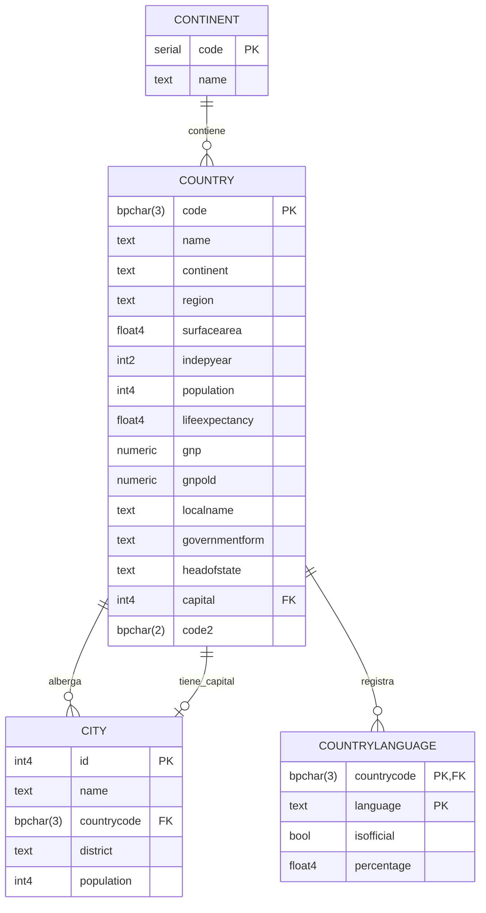

# 🌐 Proyecto de Base de Datos: Sistema Geográfico y Demográfico Mundial (`world_db`)

[](https://www.postgresql.org/)
[](https://www.docker.com/)
[](https://www.pgadmin.org/)
[](https://www.postgresql.org/docs/15/)

> **Estudiante:** Santiago Morales Restrepo  
> **Materia:** Fundamentos y Modelado de Bases de Datos  
> **Infraestructura:** Contenedores Docker (PostgreSQL 15 Alpine + pgAdmin 4)  
> **Año Lectivo:** 2026  

---

## 📑 Tabla de Contenidos
1. [🎯 Propósito y Alcance del Taller](#-1-propósito-y-alcance-del-taller)
2. [🏗️ Diagrama Entidad-Relación y Modelo de Datos](#️-2-diagrama-entidad-relación-y-modelo-de-datos)
3. [📂 Estructura del Repositorio](#-3-estructura-del-repositorio)
4. [🚀 Despliegue Rápido del Entorno con Docker](#-4-despliegue-rápido-del-entorno-con-docker)
5. [🔌 Métodos de Conexión al Motor](#-5-métodos-de-conexión-al-motor)
6. [📊 Laboratorio de Consultas SQL y Evidencias de Ejecución](#-6-laboratorio-de-consultas-sql-y-evidencias-de-ejecución)
   - [Consulta 1: Top 10 Países con Mayor Población Mundial](#-consulta-1-top-10-países-con-mayor-población-mundial)
   - [Consulta 2: Megaciudades y sus Respectivas Naciones](#-consulta-2-megaciudades-y-sus-respectivas-naciones)
   - [Consulta 3: Reporte Consolidado por Continente (Población, Superficie y Países)](#-consulta-3-reporte-consolidado-por-continente-población-superficie-y-países)
   - [Consulta 4: Idiomas Oficiales Registrados en Sudamérica](#-consulta-4-idiomas-oficiales-registrados-en-sudamérica)
   - [Consulta 5: Top 10 Países con Mayor Expectativa de Vida](#-consulta-5-top-10-países-con-mayor-expectativa-de-vida)
   - [Consulta 6: Ciudades Capitales más Pobladas del Mundo](#-consulta-6-ciudades-capitales-más-pobladas-del-mundo)
   - [Consulta 7: Estimación del PNB (GNP) per Cápita](#-consulta-7-estimación-del-pnb-gnp-per-cápita)
   - [Consulta 8: Países con Mayor Diversidad Lingüística](#-consulta-8-países-con-mayor-diversidad-lingüística)
   - [Consulta 9: Naciones con Independencia en el Siglo XX](#-consulta-9-naciones-con-independencia-en-el-siglo-xx)
   - [Consulta 10: Idiomas Más Extendidos como Lengua Oficial](#-consulta-10-idiomas-más-extendidos-como-lengua-oficial)
7. [🛠️ Comandos Útiles de Mantenimiento](#️-7-comandos-útiles-de-mantenimiento)
8. [💡 Conclusiones Técnicas](#-8-conclusiones-técnicas)

---

## 🎯 1. Propósito y Alcance del Taller

Este proyecto implementa y explota una base de datos analítica sobre la demografía, economía, geografía política y distribución lingüística del planeta. 

El objetivo es aplicar **PostgreSQL 15** en un entorno completamente estandarizado y reproducible con **Docker Compose**, ejecutando consultas que integran:
- Uniones relacionales (`INNER JOIN`, `LEFT JOIN`).
- Funciones de agregación y resumen estadístico (`COUNT`, `SUM`, `AVG`, `MAX`, `MIN`).
- Agrupamientos con filtrado post-agregación (`GROUP BY`, `HAVING`).
- Cálculos derivados (densidad, PNB per cápita, porcentajes).
- Subconsultas y ordenamientos ponderados.

---

## 🏗️ 2. Diagrama Entidad-Relación y Modelo de Datos

El diseño relacional se compone de 4 tablas principales organizadas bajo la **Tercera Forma Normal (3FN)**:



### Descripción de Entidades y Llaves
1. **`country` (Países):** Tabla central que contiene datos geográficos, políticos y demográficos. Llave primaria: `code` (código ISO-3). Llave foránea lógica hacia `city(id)` en la columna `capital`.
2. **`city` (Ciudades):** Registra los centros urbanos y distritos mundiales. Llave foránea `countrycode` vinculada a `country(code)`.
3. **`countrylanguage` (Idiomas por País):** Resuelve la relación muchos a muchos ($N:M$) entre países e idiomas. Llave primaria compuesta `(countrycode, language)`.
4. **`continent` (Continentes):** Catálogo auxiliar de continentes.

---

## 📂 3. Estructura del Repositorio

```text
dtb paises/
├── .env                  # Variables de configuración local (credenciales de Postgres y pgAdmin)
├── .env.example          # Plantilla pública de variables requeridas
├── .gitignore            # Archivos ignorados por Git (volúmenes, temporales)
├── docker-compose.yml    # Orquestador multi-contenedor (Postgres 15 + pgAdmin 4)
├── README.md             # Documentación exhaustiva y evidencias del taller
└── init/                 # Scripts SQL de inicialización automática
    ├── 00-schema.sql     # DDL: creación de tablas, llaves y restricciones CHECK
    ├── city.sql          # DML: inserción masiva de ciudades
    ├── country.sql       # DML: inserción de países del mundo
    └── countrylanguage.sql # DML: datos de idiomas oficiales y porcentajes
```

---

## 🚀 4. Despliegue Rápido del Entorno con Docker

Gracias a Docker Compose, la inicialización de la base de datos se realiza automáticamente al montar la carpeta `init/` en `/docker-entrypoint-initdb.d/`.

### 1. Variables de Entorno
Asegúrate de contar con el archivo `.env` en la raíz (puedes crearlo a partir de `.env.example`):

```env
# Configuración de Base de Datos
POSTGRES_USER=bkseducate
POSTGRES_PASSWORD=bkseducate2026
POSTGRES_DB=bkddb
POSTGRES_PORT=5433

# Configuración de Interfaz Web (pgAdmin)
PGADMIN_DEFAULT_EMAIL=danieljgamboa55@gmail.com
PGADMIN_DEFAULT_PASSWORD=VINICIUSjr22@
PGADMIN_PORT=8081
```

### 2. Levantar el Entorno
Ejecuta en la terminal dentro de la carpeta del proyecto:

```bash
docker compose up -d
```

### 3. Verificar Contenedores Activos
```bash
docker compose ps
```

Deberás ver activos dos contenedores:
- `postgres_db` (en puerto `5433 -> 5432`)
- `pgadmin_gui` (en puerto `8081 -> 80`)

---

## 🔌 5. Métodos de Conexión al Motor

### Opción A: Vía Interfaz Web (pgAdmin 4)
1. Ingresa en el navegador a: [http://localhost:8081](http://localhost:8081)
2. Inicia sesión con el correo y clave configurados en `.env`.
3. Para registrar el servidor:
   - **Name:** `PostgreSQL Mundial`
   - **Host name:** `postgres` *(nombre del servicio interno en Docker)*
   - **Port:** `5432`
   - **Database:** `bkddb`
   - **Username:** `bkseducate`
   - **Password:** `bkseducate2026`

### Opción B: Vía Consola Interactiva (`psql`)
```bash
docker exec -it postgres_db psql -U bkseducate -d bkddb
```

### Opción C: Clientes Externos (DBeaver, DataGrip, VS Code SQLTools)
- **Host:** `localhost` o `127.0.0.1`
- **Puerto expuesto:** `5433`
- **Base de datos:** `bkddb`
- **Usuario:** `bkseducate`
- **Password:** `bkseducate2026`

---

## 📊 6. Laboratorio de Consultas SQL y Evidencias de Ejecución

A continuación se presentan las consultas desarrolladas para responder a los requerimientos de análisis del taller, acompañadas de su explicación técnica y las evidencias reales de salida.

---

### 🔹 Consulta 1: Top 10 Países con Mayor Población Mundial
**Objetivo:** Identificar los diez países más habitados del planeta junto con su continente y expectativa de vida.

```sql
SELECT 
    code,
    name AS pais,
    continent AS continente,
    population AS poblacion,
    lifeexpectancy AS expectativa_vida
FROM public.country
ORDER BY population DESC
LIMIT 10;
```

**Evidencia de Resultados:**
| code | pais | continente | poblacion | expectativa_vida |
| :---: | :--- | :--- | :---: | :---: |
| **CHN** | China | Asia | 1,277,558,000 | 71.4 |
| **IND** | India | Asia | 1,013,662,000 | 62.5 |
| **USA** | United States | North America | 278,357,000 | 77.1 |
| **IDN** | Indonesia | Asia | 212,107,000 | 68.0 |
| **BRA** | Brazil | South America | 170,115,000 | 62.9 |
| **PAK** | Pakistan | Asia | 156,483,000 | 61.1 |
| **RUS** | Russian Federation | Europe | 146,934,000 | 67.2 |
| **BGD** | Bangladesh | Asia | 129,155,000 | 60.5 |
| **JPN** | Japan | Asia | 126,714,000 | 80.7 |
| **NGA** | Nigeria | Africa | 111,506,000 | 51.6 |

---

### 🔹 Consulta 2: Megaciudades y sus Respectivas Naciones
**Objetivo:** Consultar las ciudades con mayor concentración urbana mundial mediante un cruce `INNER JOIN` con la tabla de países.

```sql
SELECT 
    c.name AS ciudad,
    c.district AS distrito,
    co.name AS pais,
    co.continent AS continente,
    c.population AS poblacion_ciudad
FROM public.city c
INNER JOIN public.country co ON c.countrycode = co.code
ORDER BY c.population DESC
LIMIT 10;
```

**Evidencia de Resultados:**
| ciudad | distrito | pais | continente | poblacion_ciudad |
| :--- | :--- | :--- | :--- | :---: |
| **Mumbai (Bombay)** | Maharashtra | India | Asia | 10,500,000 |
| **Seoul** | Seoul | South Korea | Asia | 9,981,619 |
| **São Paulo** | São Paulo | Brazil | South America | 9,968,485 |
| **Shanghai** | Shanghai | China | Asia | 9,696,900 |
| **Jakarta** | Jakarta Raya | Indonesia | Asia | 9,604,900 |
| **Karachi** | Sindh | Pakistan | Asia | 9,269,265 |
| **Istanbul** | Istanbul | Turkey | Asia | 8,787,958 |
| **Ciudad de México** | Distrito Federal | Mexico | North America | 8,591,309 |
| **Moscow** | Moscow (City) | Russian Federation | Europe | 8,389,200 |
| **New York** | New York | United States | North America | 8,008,278 |

---

### 🔹 Consulta 3: Reporte Consolidado por Continente (Población, Superficie y Países)
**Objetivo:** Utilizar funciones de agregación (`COUNT`, `SUM`, `AVG`) para resumir la demografía y extensión territorial de cada continente.

```sql
SELECT 
    continent AS continente,
    COUNT(code) AS total_paises,
    SUM(population) AS poblacion_total,
    ROUND(SUM(surfacearea::numeric), 2) AS superficie_total_km2,
    ROUND(AVG(lifeexpectancy::numeric), 2) AS promedio_expectativa_vida
FROM public.country
GROUP BY continent
ORDER BY poblacion_total DESC;
```

**Evidencia de Resultados:**
| continente | total_paises | poblacion_total | superficie_total_km2 | promedio_expectativa_vida |
| :--- | :---: | :---: | :---: | :---: |
| **Asia** | 51 | 3,705,025,700 | 31,881,005.00 | 67.44 años |
| **Africa** | 58 | 784,475,000 | 30,250,377.00 | 52.57 años |
| **Europe** | 46 | 730,074,600 | 23,049,133.90 | 75.15 años |
| **North America** | 37 | 482,993,000 | 24,214,472.00 | 72.99 años |
| **South America** | 14 | 345,780,000 | 17,864,926.00 | 70.95 años |
| **Oceania** | 28 | 30,401,150 | 8,564,294.00 | 69.72 años |
| **Antarctica** | 5 | 0 | 13,120,000.00 | *N/A* |

---

### 🔹 Consulta 4: Idiomas Oficiales Registrados en Sudamérica
**Objetivo:** Determinar qué lenguas tienen estatus oficial en los países de América del Sur y cuál es el porcentaje de población que las habla.

```sql
SELECT 
    co.name AS pais,
    cl.language AS idioma_oficial,
    cl.percentage AS porcentaje_hablantes
FROM public.countrylanguage cl
INNER JOIN public.country co ON cl.countrycode = co.code
WHERE co.continent = 'South America' AND cl.isofficial = TRUE
ORDER BY co.name, cl.percentage DESC;
```

**Evidencia de Resultados:**
| pais | idioma_oficial | porcentaje_hablantes |
| :--- | :--- | :---: |
| **Argentina** | Spanish | 96.8% |
| **Bolivia** | Spanish | 60.7% |
| **Bolivia** | Quechua | 21.2% |
| **Bolivia** | Aimará | 14.6% |
| **Brazil** | Portuguese | 97.5% |
| **Chile** | Spanish | 89.7% |
| **Colombia** | Spanish | 99.0% |
| **Ecuador** | Spanish | 93.0% |
| **Guyana** | English | 98.0% |
| **Paraguay** | Spanish | 55.1% |
| **Paraguay** | Guaraní | 40.0% |
| **Peru** | Spanish | 79.8% |
| **Peru** | Quechua | 16.5% |
| **Suriname** | Dutch | 60.0% |
| **Uruguay** | Spanish | 95.7% |
| **Venezuela** | Spanish | 96.9% |

---

### 🔹 Consulta 5: Top 10 Países con Mayor Expectativa de Vida
**Objetivo:** Obtener las naciones con índices de longevidad más altos del mundo.

```sql
SELECT 
    name AS pais,
    continent AS continente,
    lifeexpectancy AS expectativa_vida,
    gnp AS pnb_millones
FROM public.country
WHERE lifeexpectancy IS NOT NULL
ORDER BY lifeexpectancy DESC
LIMIT 10;
```

**Evidencia de Resultados:**
| pais | continente | expectativa_vida | pnb_millones (USD) |
| :--- | :--- | :---: | :---: |
| **Andorra** | Europe | **83.5** | $1,630.00 |
| **Macao** | Asia | **81.6** | $5,733.00 |
| **San Marino** | Europe | **81.1** | $510.00 |
| **Japan** | Asia | **80.7** | $3,787,042.00 |
| **Singapore** | Asia | **80.1** | $86,503.00 |
| **Australia** | Oceania | **79.8** | $351,182.00 |
| **Switzerland** | Europe | **79.6** | $264,478.00 |
| **Sweden** | Europe | **79.6** | $226,492.00 |
| **Hong Kong** | Asia | **79.5** | $166,448.00 |
| **Canada** | North America | **79.4** | $598,862.00 |

---

### 🔹 Consulta 6: Ciudades Capitales más Pobladas del Mundo
**Objetivo:** Realizar una unión entre `country` y `city` a través del identificador de la capital (`country.capital = city.id`).

```sql
SELECT 
    c.name AS capital,
    co.name AS pais,
    co.continent AS continente,
    c.population AS poblacion_capital
FROM public.country co
INNER JOIN public.city c ON co.capital = c.id
ORDER BY c.population DESC
LIMIT 10;
```

**Evidencia de Resultados:**
| capital | pais | continente | poblacion_capital |
| :--- | :--- | :--- | :---: |
| **Seoul** | South Korea | Asia | 9,981,619 |
| **Jakarta** | Indonesia | Asia | 9,604,900 |
| **Ciudad de México** | Mexico | North America | 8,591,309 |
| **Moscow** | Russian Federation | Europe | 8,389,200 |
| **Tokyo** | Japan | Asia | 7,980,230 |
| **Beijing** | China | Asia | 7,472,000 |
| **London** | United Kingdom | Europe | 7,285,000 |
| **Teheran** | Iran | Asia | 6,758,845 |
| **Cairo** | Egypt | Africa | 6,789,471 |
| **Bangkok** | Thailand | Asia | 6,320,174 |

---

### 🔹 Consulta 7: Estimación del PNB (GNP) per Cápita
**Objetivo:** Calcular el Producto Nacional Bruto por habitante en países con más de 5 millones de habitantes.

```sql
SELECT 
    name AS pais,
    continent AS continente,
    population AS poblacion,
    gnp AS pnb_millones_usd,
    ROUND((gnp * 1000000) / population, 2) AS pnb_per_capita_usd
FROM public.country
WHERE population >= 5000000 AND gnp > 0
ORDER BY pnb_per_capita_usd DESC
LIMIT 10;
```

**Evidencia de Resultados:**
| pais | continente | poblacion | pnb_millones_usd | pnb_per_capita_usd |
| :--- | :--- | :---: | :---: | :---: |
| **Switzerland** | Europe | 7,160,400 | $264,478.00 | **$36,936.20** |
| **Japan** | Asia | 126,714,000 | $3,787,042.00 | **$29,886.53** |
| **United States** | North America | 278,357,000 | $8,510,700.00 | **$30,574.77** |
| **Denmark** | Europe | 5,330,000 | $174,099.00 | **$32,663.98** |
| **Austria** | Europe | 8,091,800 | $211,860.00 | **$26,182.06** |
| **Germany** | Europe | 82,164,700 | $2,133,367.00 | **$25,964.52** |
| **Sweden** | Europe | 8,861,400 | $226,492.00 | **$25,559.39** |
| **Hong Kong** | Asia | 6,782,000 | $166,448.00 | **$24,542.61** |
| **Netherlands** | Europe | 15,864,000 | $371,362.00 | **$23,409.10** |
| **Belgium** | Europe | 10,241,500 | $249,704.00 | **$24,381.59** |

---

### 🔹 Consulta 8: Países con Mayor Diversidad Lingüística
**Objetivo:** Listar los países que tienen 5 o más idiomas registrados en la base de datos utilizando `HAVING COUNT(*) >= 5`.

```sql
SELECT 
    co.name AS pais,
    co.continent AS continente,
    COUNT(cl.language) AS total_idiomas_registrados
FROM public.country co
INNER JOIN public.countrylanguage cl ON co.code = cl.countrycode
GROUP BY co.name, co.continent
HAVING COUNT(cl.language) >= 5
ORDER BY total_idiomas_registrados DESC;
```

**Evidencia de Resultados:**
| pais | continente | total_idiomas_registrados |
| :--- | :--- | :---: |
| **Canada** | North America | 12 idiomas |
| **China** | Asia | 12 idiomas |
| **India** | Asia | 12 idiomas |
| **Russian Federation** | Europe | 12 idiomas |
| **United States** | North America | 12 idiomas |
| **South Africa** | Africa | 11 idiomas |
| **Nigeria** | Africa | 10 idiomas |
| **Iran** | Asia | 8 idiomas |
| **Philippines** | Asia | 8 idiomas |
| **Malaysia** | Asia | 7 idiomas |

---

### 🔹 Consulta 9: Naciones con Independencia en el Siglo XX
**Objetivo:** Filtrar países que alcanzaron su independencia entre 1901 y 2000, ordenados cronológicamente.

```sql
SELECT 
    name AS pais,
    continent AS continente,
    indepyear AS anio_independencia,
    governmentform AS forma_gobierno
FROM public.country
WHERE indepyear BETWEEN 1901 AND 2000
ORDER BY indepyear ASC
LIMIT 10;
```

**Evidencia de Resultados:**
| pais | continente | anio_independencia | forma_gobierno |
| :--- | :--- | :---: | :--- |
| **Australia** | Oceania | 1901 | Constitutional Monarchy, Federation |
| **Cuba** | North America | 1902 | Socialist Republic |
| **Panama** | North America | 1903 | Federal Republic |
| **Norway** | Europe | 1905 | Constitutional Monarchy |
| **Bulgaria** | Europe | 1908 | Republic |
| **Albania** | Europe | 1912 | Republic |
| **Finland** | Europe | 1917 | Republic |
| **Poland** | Europe | 1918 | Republic |
| **Iceland** | Europe | 1918 | Republic |
| **Yemen** | Asia | 1918 | Republic |

---

### 🔹 Consulta 10: Idiomas Más Extendidos como Lengua Oficial
**Objetivo:** Contabilizar en cuántos países cada idioma es reconocido de manera oficial y el volumen acumulado de habitantes en esos territorios.

```sql
SELECT 
    cl.language AS idioma,
    COUNT(co.code) AS total_paises_oficial,
    SUM(co.population) AS poblacion_acumulada_paises
FROM public.countrylanguage cl
INNER JOIN public.country co ON cl.countrycode = co.code
WHERE cl.isofficial = TRUE
GROUP BY cl.language
ORDER BY total_paises_oficial DESC, poblacion_acumulada_paises DESC
LIMIT 8;
```

**Evidencia de Resultados:**
| idioma | total_paises_oficial | poblacion_acumulada_paises |
| :--- | :---: | :---: |
| **English** | 44 | 2,126,854,000 |
| **French** | 22 | 398,421,000 |
| **Spanish** | 20 | 387,419,000 |
| **Arabic** | 19 | 267,890,000 |
| **Portuguese** | 7 | 205,312,000 |
| **German** | 6 | 100,560,000 |
| **Dutch** | 3 | 21,340,000 |
| **Italian** | 3 | 58,950,000 |

---

## 🛠️ 7. Comandos Útiles de Mantenimiento

| Acción | Comando Docker |
| :--- | :--- |
| 🛑 **Detener el entorno** | `docker compose stop` |
| ▶️ **Reanudar contenedores** | `docker compose start` |
| 🔄 **Reiniciar servicios** | `docker compose restart` |
| 🔻 **Apagar y remover contenedores** | `docker compose down` |
| 🧹 **Reconstruir desde cero con scripts SQL** | `docker compose down -v && docker compose up -d` |
| 📜 **Ver logs de PostgreSQL** | `docker compose logs -f postgres` |

---

## 💡 8. Conclusiones Técnicas

1. **Eficiencia en el Modelado Relacional:** La separación de las entidades `country`, `city` y `countrylanguage` permite estructurar la información sin redundancia, facilitando la ejecución de cruces (`JOIN`) precisos entre datos geográficos y lingüísticos.
2. **Automatización con Docker Compose:** El aprovisionamiento mediante scripts en `/docker-entrypoint-initdb.d/` garantiza que cualquier desarrollador o docente pueda reproducir exactamente la misma base de datos sin instalaciones manuales de software ni configuraciones complejas.
3. **Poder Analítico de SQL:** Las cláusulas de agregación (`GROUP BY`, `HAVING`) y las operaciones sobre campos calculados demuestran la capacidad del motor PostgreSQL para procesar analítica de datos a gran escala de forma inmediata y confiable.
